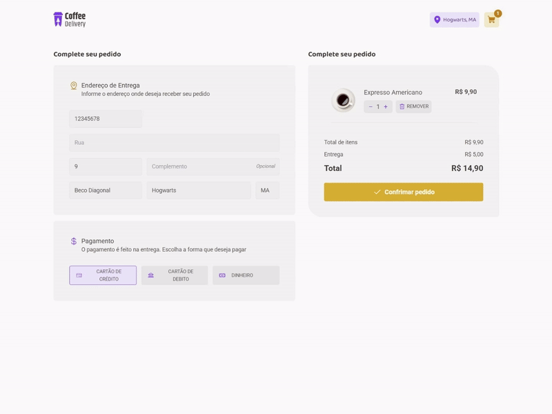
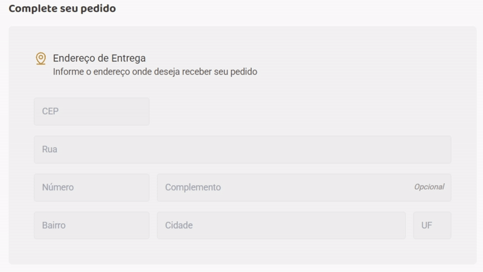
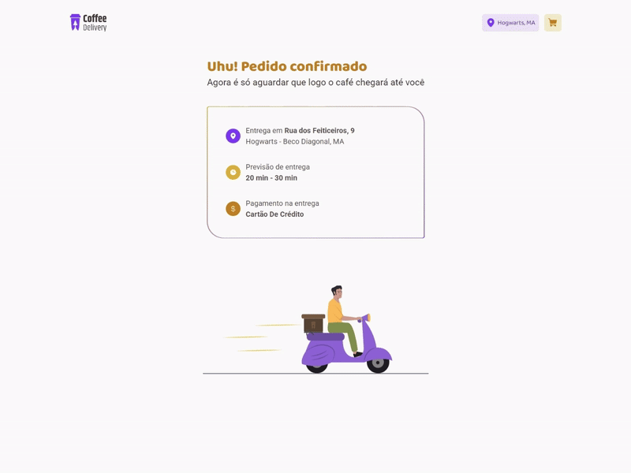

# RocketSeat - Coffe Delivery
- Uma aplicação de Cafeteria criada como parte de um curso de React da RocketSeat.
- Você pode testar a aplicação aqui > [Coffe Delivery.io](https://thegorje.github.io/coffe-delivery/)

## Funcionalidades

- Seleção de produtos de café
- Ajuste de quantidades no carrinho
- Adicionar e remover produtos no carrinho
- Visualizar o carrinho com opções de ajustar quantidades e remover itens
- Ver o total do preço dos itens no carrinho
- Checkout com resumo do pedido
- Inserção de endereço
- Preenchimento automático do endereço ao inserir o CEP
- Opções de pagamento: cartão ou dinheiro
- Designer flexível

## Tecnologias Utilizadas

- React
- TypeScript
- Vite
- tailwind
- hookform
- zod
- immer
- phosphor

### Interface da Aplicação
- No desafio, foi fornecido um layout no Figma para que eu pudesse seguir e implementar todas as funcionalidades.
- Design da Interface criada no Figma: [Millena Martins](https://www.linkedin.com/in/millenamartins/) Product Designer da RocketSeat.

## Home

#### Página inicial flexível

## Lista de Cafés

#### Lista de cafés, com funcionalidades de adicionar e remover cafés no carrinho, visualização e edição dos valores.

## Finalizar Compra

#### Processo de checkout completo, incluindo formulários, opções de métodos de pagamento e finalização do pedido.

#### Sistema de preenchimento automático de endereço ao inserir o CEP.

## Pedido Concluído

#### Página final de confirmação do pedido concluído, feito em CSS com imagens estaticas.
